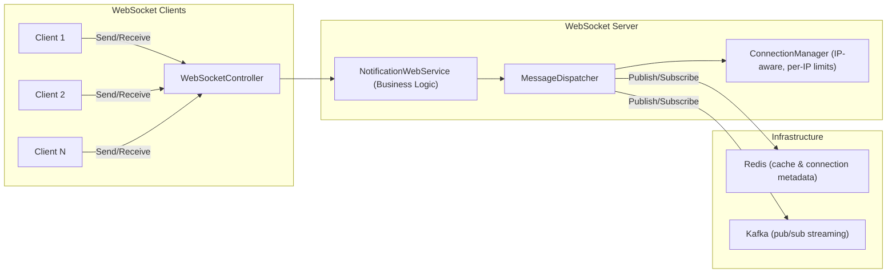

# WebSocketLib

A .NET library for managing **WebSocket connections** with support for **message broadcasting, direct messaging, Kafka integration, Redis caching, and per-IP connection limiting**.
Built with ASP.NET Core and designed for **scalable real-time communication**.

---

## ✨ Features

* Manage multiple WebSocket client connections with **IP tracking**.
* Limit the number of connections per IP to prevent abuse.
* Broadcast messages to all clients with **concurrent + fault-tolerant sending**.
* Automatic cleanup of **dead or broken sockets**.
* Optional **throttling / batching** to smooth out high-throughput events.
* Send direct messages to specific clients.
* Structured message handling with JSON.
* Kafka integration for message streaming across services.
* Redis integration for connection management and caching.
* Middleware for logging and telemetry.
* **Message shape and schema determined by the WebSocketService**, allowing flexible contracts.

---

## 🏗️ Architecture

Below is how the components interact in a real-world WebSocket server:



* **WebSocketController**

  * Accepts incoming `/ws` connections.
  * Validates IP limits and rejects connections exceeding the per-IP threshold.
  * Generates `clientId` and delegates to `NotificationWebService`.

* **NotificationWebService**

  * Handles WebSocket **lifecycle** (receive loop, disconnects).
  * Parses incoming messages and determines type (`broadcast` / `direct`).
  * Delegates message distribution to **MessageDispatcher**.

* **MessageDispatcher**

  * Integrates **local sockets** with external brokers (Kafka/Redis).
  * Manages topic subscriptions, broadcasts messages, and synchronizes messages across server instances.

* **ConnectionManager**

  * Maintains a **thread-safe registry** of active sockets.
  * Tracks **clientId → IP** mappings.
  * Enforces **per-IP connection limits**.
  * Sends direct messages and handles concurrent broadcast with fault-tolerance.

* **Redis**

  * Optional: connection metadata and lightweight pub/sub.

* **Kafka**

  * Optional: scalable, high-throughput event streaming and cross-service communication.

---

## 🔄 Connection & Message Flow

### 1️⃣ Client Connects

1. Client opens WebSocket connection to `ws://server/api/websocket/ws`.
2. **WebSocketController**:

   * Validates WebSocket request.
   * Retrieves client IP.
   * Checks **per-IP connection limit**.
   * Generates `clientId`.
   * Accepts connection and passes socket + clientId + IP to **NotificationWebService**.
3. **NotificationWebService**:

   * Registers socket with **ConnectionManager**.
   * Starts **receive loop**.
4. Connection ready to receive messages.

### 2️⃣ Client Sends a Message

1. Message arrives on WebSocket receive loop.
2. **NotificationWebService**:

   * Parses JSON to check `type` (`broadcast` / `direct`).
   * Delegates to **MessageDispatcher**.
3. **MessageDispatcher**:

   * Sends to local clients via **ConnectionManager**.
   * Publishes to external broker if applicable (Kafka/Redis).
4. **ConnectionManager**:

   * Looks up target sockets.
   * Sends message via `WebSocket.SendAsync()`.
   * Cleans up any closed or dead sockets.

### Summary Table

| Step | Component              | Responsibility                                              |
| ---- | ---------------------- | ----------------------------------------------------------- |
| 1    | Client                 | Opens WebSocket connection                                  |
| 2    | WebSocketController    | Accepts connection, validates IP limits, generates clientId |
| 3    | NotificationWebService | Registers socket, starts receive loop                       |
| 4    | Client                 | Sends message (JSON)                                        |
| 5    | NotificationWebService | Parses message, delegates to MessageDispatcher              |
| 6    | MessageDispatcher      | Dispatches to local clients or publishes to broker          |
| 7    | ConnectionManager      | Sends message via WebSocket, maintains socket state         |

This architecture clearly separates concerns:

* **Controller** → HTTP/WebSocket entry point
* **NotificationWebService** → Connection lifecycle & business logic
* **MessageDispatcher** → Message distribution & broker integration
* **ConnectionManager** → Socket lifecycle, IP tracking, broadcast/direct sends

---

## 🚀 Getting Started

### Prerequisites

* [.NET 8 SDK](https://dotnet.microsoft.com/)
* [Docker](https://www.docker.com/)
* [Kafka](https://kafka.apache.org/)
* [Redis](https://redis.io/)

### Clone the repository

```bash
git clone https://github.com/emmanuel-karanja/WebSocketLib.git
cd WebSocketLib
```

### Build the project

```bash
dotnet build
```

### Run locally

```bash
dotnet run --project WebSocketUtils.Demo
```

WebSocket endpoint:

```
GET ws://localhost:5000/api/websocket/ws
```

---

## 🐳 Docker Setup

```bash
docker-compose up --build
```

This starts:

* WebSocketLib Demo API on `http://localhost:5000`
* Kafka broker on `localhost:9092`
* Redis on `localhost:6379`

Stop services:

```bash
docker-compose down
```

---

## 🔌 Example Usage

1. Open a WebSocket connection:

```bash
ws://localhost:5000/api/websocket/ws
```

2. Broadcast message:

```json
{
  "type": "broadcast",
  "message": "Hello everyone!"
}
```

3. Direct message:

```json
{
  "type": "direct",
  "target": "<client-id>",
  "message": "Hello friend!"
}
```

> Handled by **NotificationWebService**, delegated to **MessageDispatcher** for delivery and optional broker integration.

---

## 📂 Project Structure

```
WebSocketLib/
│
├── WebSocketUtils/                # Core WebSocket utilities
│   ├── Connection/                 # ConnectionManager & MessageDispatcher
│   ├── Middleware/                 # Logging & telemetry middleware
│   ├── WebSocketUtils.csproj
│
├── WebSocketUtils.Demo/           # Demo ASP.NET Core project
│   ├── Controllers/                # WebSocketController endpoints
│   ├── Services/                   # NotificationWebService + Kafka/Redis services
│   ├── Extensions/                 # DI/configuration helpers
│   ├── Options/                    # Config binding classes
│   ├── WebSocketUtils.Demo.csproj
│
├── WebSocketUtils.Tests/          # Unit and integration tests
│
├── docker-compose.yml             # Local environment (WebSocket + Kafka + Redis)
├── Dockerfile                     # Container build file
├── .gitignore
├── README.md                      # Project documentation
```

---

## 🧪 Testing

```bash
dotnet test
```

---

## 🤝 Contributing

1. Fork the repository.
2. Create a feature branch (`git checkout -b feature/my-feature`).
3. Commit your changes (`git commit -m 'Add new feature'`).
4. Push to the branch (`git push origin feature/my-feature`).
5. Open a Pull Request.

---

## 📜 License

MIT License. See [LICENSE](LICENSE)
