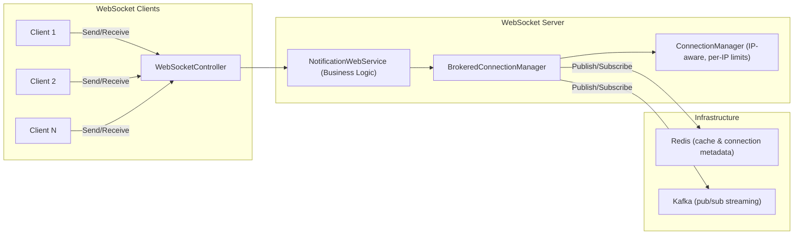

# WebSocketLib

A .NET library for managing **WebSocket connections** with support for **message broadcasting, direct messaging, Kafka integration, Redis caching, and per-IP connection limiting**.
Built with ASP.NET Core and designed for **scalable real-time communication**.

---

## ✨ Features

* Manage multiple WebSocket client connections with **IP tracking**.
* Limit the number of connections per IP to prevent abuse.
* Broadcast messages to all clients with **concurrent + fault-tolerant sending**.
* Automatic cleanup of **dead or broken sockets**.
* Optional **throttling / batching** to smooth out high-throughput events.
* Send direct messages to specific clients.
* Structured message handling with JSON.
* Kafka integration for message streaming across services.
* Redis integration for connection management and caching.
* Middleware for logging and telemetry.
* **Message shape and schema determined by the WebSocketService**, allowing flexible contracts.

---

## 🏗️ Architecture

Below is how the components interact in a real-world WebSocket server:



* **WebSocketController**
  Accepts incoming `/ws` connections, validates IP limits, generates `clientId`, and delegates to `NotificationWebService`.

* **NotificationWebService**
  Handles the WebSocket **lifecycle** (receive loop, disconnects) and delegates message handling (`broadcast` / `direct`) to `BrokeredConnectionManager`.

* **BrokeredConnectionManager**
  Integrates **local sockets** with external brokers (Kafka/Redis) and manages topic subscriptions.
  Broadcasts messages to clients, supports pub/sub, and keeps the server instance synchronized.

* **ConnectionManager**
  Maintains a **thread-safe registry** of active sockets, tracks **clientId → IP**, enforces **per-IP connection limits**, sends direct messages, and handles concurrent broadcast.

* **Redis**
  Optional: connection metadata and lightweight pub/sub.

* **Kafka**
  Optional: scalable, high-throughput event streaming and cross-service communication.

---

## 🚀 Getting Started

### Prerequisites

* [.NET 8 SDK](https://dotnet.microsoft.com/)
* [Docker](https://www.docker.com/)
* [Kafka](https://kafka.apache.org/)
* [Redis](https://redis.io/)

### Clone the repository

```bash
git clone https://github.com/emmanuel-karanja/WebSocketLib.git
cd WebSocketLib
```

### Build the project

```bash
dotnet build
```

### Run locally

```bash
dotnet run --project WebSocketUtils.Demo
```

This will start the demo API with the WebSocket endpoint:

```
GET ws://localhost:5000/api/websocket/ws
```

---

## 🐳 Docker Setup

We provide a **Docker Compose** configuration to run the project along with Kafka and Redis.

### Build and Run with Docker Compose

```bash
docker-compose up --build
```

This starts:

* **WebSocketLib Demo API** on `http://localhost:5000`
* **Kafka** broker on `localhost:9092`
* **Redis** on `localhost:6379`

### Stop services

```bash
docker-compose down
```

---

## 🔌 Example Usage

### Connecting with Postman or a WebSocket client

1. Open a WebSocket connection to:

   ```bash
   ws://localhost:5000/api/websocket/ws
   ```

2. Send a broadcast message:

   ```json
   {
     "type": "broadcast",
     "message": "Hello everyone!"
   }
   ```

3. Send a direct message:

   ```json
   {
     "type": "direct",
     "target": "<client-id>",
     "message": "Hello friend!"
   }
   ```

> **Note:** Messages are handled by **NotificationWebService**, which delegates to **BrokeredConnectionManager** for delivery and optional broker integration.

---

## 📂 Project Structure

```
WebSocketLib/
│
├── WebSocketUtils/                # Core WebSocket utilities
│   ├── Connection/                 # ConnectionManager & BrokeredConnectionManager
│   ├── Middleware/                 # Logging & telemetry middleware
│   ├── WebSocketUtils.csproj
│
├── WebSocketUtils.Demo/           # Demo ASP.NET Core project
│   ├── Controllers/                # WebSocket endpoints (WebSocketController)
│   ├── Services/                   # NotificationWebService + Kafka/Redis services
│   ├── Extensions/                 # DI/configuration helpers
│   ├── Options/                    # Config binding classes
│   ├── WebSocketUtils.Demo.csproj
│
├── WebSocketUtils.Tests/          # Unit and integration tests
│
├── docker-compose.yml             # Local environment (WebSocket + Kafka + Redis)
├── Dockerfile                     # Container build file
├── .gitignore
├── README.md                      # Project documentation
```

---

## 🧪 Testing

Run unit tests:

```bash
dotnet test
```

---

## 🤝 Contributing

1. Fork the repository.
2. Create a feature branch (`git checkout -b feature/my-feature`).
3. Commit your changes (`git commit -m 'Add new feature'`).
4. Push to the branch (`git push origin feature/my-feature`).
5. Open a Pul
